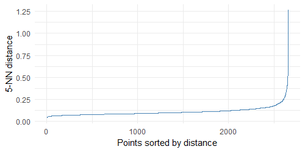
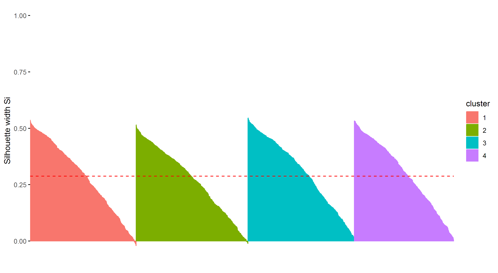
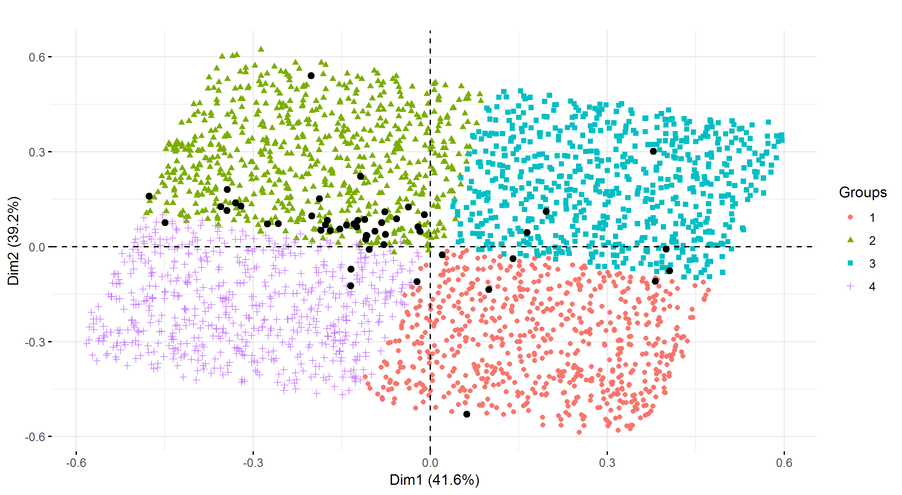

```{r setup, include=FALSE}
chooseCRANmirror(graphics=FALSE, ind=1)
knitr::opts_chunk$set(echo=F, warning=F, message=F,fig.align='center',fig.pos='H')
# load libraries y functions
source("functions.R")
source("libraries.R")
```

```{r objects, include=FALSE}
# carga objetos relevantes ya generados
hip_raw = readRDS("data/working/hip_raw.RDS")
tyc_raw = readRDS("data/working/tyc_raw.RDS")
hip_hopkins = readRDS("output/hopkins_hipparcos.RDS")
tyc_hopkins = readRDS("output/hopkins_tycho.RDS")
km_hip = readRDS("data/working/km_hipparcos.RDS")
km_tyc = readRDS("data/working/km_tyc.RDS")
hip_table_km_hd = readRDS("output/tablehyades_km_hipparcos.RDS")
tyc_table_km_hd = readRDS("output/tablehyades_km_tycho.RDS")
hip_sc = readRDS("data/working/hip_sc.RDS")

```

# Comprensión del dominio

## Información general del dominio

En el presente informe se presenta un análisis realizado en base a los datos recolectados por la misión espacial Hipparcos, los cuales se volcaron en dos cátalogos con distinta calidad de información, Hipparcos y Tycho, y un listado de estrellas que los astrónomos asignaron a las Hyades (cluster abierto de estrellas).

Este último cluster es el objeto de interés central del presente estudio. Se trata de un cluster abierto cuyas estrellas se originaron a partir de la misma nube molecular. Estas estrellas tienden a tener características químicas y edades similares, lo cual hace posible agruparlas utilizando ciertas variables. Tiene unas 300 a 400 miembros, con un núcleo de 17,6 años luz de diámetro con estrellas cercanas entre sí, rodeada por otro grupo de estrellas más separadas entre sí.

## Recursos

El análisis se llevó a cabo a partir de los datos disponibles en dos catálogos de estrellas, Hipparcos y Tycho, un listado de estrellas pertenecientes a las Hyades y un archivo que permite cruzar las estrellas identificadas como Hyades con estrellas registradas en el catálogo de Hipparcos (ver Sección \@ref(datos)).

Se usó hardware de uso personal con un procesador Intel Core i7 y 8 GB de memoria RAM. El análisis se llevó a cabo en lenguaje R en su versión 3.5.0, con la asistencia de la IDE RStudio y del conjunto de librerías *tidyverse*. Asimismo, para las tareas de clustering y su respectivo diagnóstico se usaron las librerías *cluster*, *factoextra*, *clustertend* y *dbscan*.

## Objetivo de data mining

El objetivo principal del trabajo es encontrar dentro de los catálogos Hipparcos y Tycho estrellas que podrían pertenecer a las Hyades. Esta identificación de estrellas candidatas se realizó mediantes técnicas de clustering: las estrellas pertenecientes al mismo agrupamiento que una cantidad significativa de las ya identificadas como Hyades son consideradas candidatas. Se realizaron asimismo las siguientes actividades adicionales relacionadas al objetivo general: un estudio de las características diferenciales de las estrellas candidatas de ambos catálogos, una identificación de estrellas candidatas en Hipparcos a partir de métodos de clustering difuso y por densidad, una exportación de un modelo de K-Medias con la especificación PMML desde R hacia Python y un análisis de datos faltantes de paralaje en Tycho.

## Plan del proyecto

No corresponde.

# Comprensión de los datos {#datos}

## Recolección inicial de los datos {#datos-rec}

Los datos analizados provienen de mediciones realizadas por la misión espacial Hipparcos de la Agencia Espacial Europea entre 1989 y 1993, los cuales se volcaron en dos cátalogos con distinta calidad de información: Hipparcos y Tycho. Los datos efectivamente usados corresponden a un subconjunto de estas mediciones provistas en archivo Excel junto a la consigna del informe. La información de este archivo fue importada al entorno R por medio de la librería *readxl* de *tidyverse*.

## Descripción de los datos {#datos-desc}

El catálogo Hipparcos cuenta con `r nrow(hip_raw)` estrellas, sobre las cuales se midieron los atributos descritos en el Cuadro \@ref(tab:hip-atr). Por su parte, Tycho tiene `r nrow(tyc_raw)` registros definidos por los atributos presentados en el Cuadro \@ref(tab:tyc-atr). `r sum(hip_raw$HIP %in% tyc_raw$HIP)` de las estrellas de Hipparcos se encuentran identificadas en Tycho. Se sabe de la existencia de 50 Hyades, de las cuales 49 están presentes en Tycho y la totalidad en Hipparcos.

```{r hip-atr}
hip_desc = readRDS("output/desc_hipparcos.RDS")
hip_desc %>% kable(caption="Descripción del catálogo Hipparcos",booktabs=T) %>%
  kable_styling(latex_options="HOLD_position")
```

```{r tyc-atr}
tyc_desc = readRDS("output/desc_tycho.RDS")
tyc_desc %>% kable(caption="Descripción del catálogo Tycho",booktabs=T) %>%
  kable_styling(latex_options="HOLD_position")
```

## Exploración de los datos {#datos-exp}

Se realizó un análisis exploratorio de los catálogos Hipparcos y Tycho por separado, primero a nivel agregado y luego diferenciando por pertenencia confirmada al cluster Hyades.

Para esta etapa fue necesario llevar adelante las tareas de preprocesamiento descritas en las Secciones \@ref(datos-seleccion) y \@ref(datos-limpieza).

### Hipparcos

En la Figura \@ref(fig:cor-hip) resulta interesante ver que las variables no presentan correlaciones muy fuertes, destacándose únicamente la relación negativa entre las dos métricas de movimiento propio. A su vez el paralaje correlaciona positivamente con *pmRA* y negativamente con *pmDE*.

```{r cor-hip, out.width='50%', fig.cap="Correlograma (Hipparcos)"}
knitr::include_graphics(c("output/plots/cor_hip.png"))
```

En los gráficos de densidad de la Figura \@ref(fig:dens-hip) se puede observar que la mayoría de las medianas de las variables son distintas aunque se encuentran próximas entre un grupo y otro. La dispersión es menor por lo general en las Hyades. Esto último resulta razonable ya que se supone que son similares entre ellas.

Algunos casos destacables son la variable de temperatura *B-V*, que presenta una mediana similar entre grupos; sin embargo las Hyades tienen sus valores concentrados mucho menos dispersas respecto al resto de las estrellas. Por otra parte, la variable de magnitud *Vmag* presenta una dispersión dentro de todo comparable entre ambos grupos, pero con una mediana claramente distinta entre ellos, siendo menor la correspondiente a las Hyades.

```{r dens-hip, out.width='80%',fig.cap="Densidades de las variables (Hipparcos)"}

```

### Tycho

Al observar las correlaciones entre variables de Tycho en la Figura \@ref(fig:cor-tyc) se puede ver que las variables *pmRA* y *pmDE*, que en Hipparcos mostraban una correlación relevante, aquí no figuran con valores altos.

```{r cor-tyc, out.width='50%',  fig.cap="Correlograma (Tycho)"}
knitr::include_graphics(c("output/plots/cor_tyc.png"))
```

Por otra parte, como se observa en la Figura \@ref(fig:dens-tyc) se registran evidencias más fuertes de la diferencia entre las estrellas pertenecientes a las Hyades y el resto. Las medianas y las dispersiones presentan diferencias mayores, a la vez que se observa una gran cantidad de outliers univariados para las estrellas no pertenecientes a las Hyades.

```{r dens-tyc, out.width='80%',fig.cap="Densidades de las variables (Tycho)"}

```

## Verificación de la calidad de los datos {#datos-calidad}

El análisis de la calidad de los datos consistió en la detección y análisis de datos faltantes. En Hipparcos únicamente la variable *B-V* cuenta con registros faltantes, en particular en `r sum(is.na(hip_raw[['B-V']]))` de los `r nrow(hip_raw)` casos. En Tycho el atributo *Plx* presenta `r sum(is.na(tyc_raw[['Plx']]))` instancias faltantes, lo cual representa el `r (sum(is.na(tyc_raw[['Plx']])) / nrow(tyc_raw) * 100) %>% round(2)`% de los registros.

Se estudió si existe algún patrón en los datos que explique la presencia o ausencia de datos faltantes en el atributo *Plx* (paralaje) de Tycho.

En primer lugar se realizó un análisis gráfico comparando el comportamiento de los registros con faltantes en el paralaje y los que no. El análisis de las densidades comparadas (Figura \@ref(fig:na-tyc)) reveló que las estrellas con faltantes en el paralaje presentan valores más elevados en las variables *BT*, *V* y *VT*, a la vez que se observa una menor dispersión en los valores de dichas variables para las estrellas que tuvieron faltantes.

```{r na-tyc, out.width='70%',fig.cap="Densidades de las variables según presencia de datos de paralaje (Tycho)"}

```

Luego se realizó un test de diferencia de medias para ver si la diferencia de medias entre las estrellas con faltantes en el paralaje y las que no lo tienen resulta estadísticamente significativa. De esta análisis resultó que las medias de todas las variales son estadísticamente significativas exceptuando la variable *DE_J2000*.

A continuación se realizó un test para evaluar si los faltantes son MCAR (Missing Completely At Random) untilizando el algoritmo *LittleMCAR* del paquete *BaylorEdPsych*. En estos casos, el mecanismo de faltantes no depende ni de la variable de interés ni de otra variable que es observada en el dataset. El resultado del test rechazó la hipótesis nula de que los datos faltantes son MCAR. Por lo tanto, deberían ser MAR (Missing at Random) o Nonignorable missing data.

Se realizó una prueba empírica para ver si los datos existentes logran predecir la presencia o no de faltantes. Se generó un modelo predictivo sencillo utilizando la implementación de Random Forest del paquete *randomForest*. Se entrenó al modelo con el 80% del dataset y se lo testeó con el 20% restante. Se obtuvo un Accuracy de 0.92 y un AUC del 0.78. Si bien se parte de una no-information rate de 0.86, los datos parecerían tener significatividad a la hora de determinar la presencia o no de faltantes en los datos de paralaje.

En cuanto a la imputación de datos, por tratarse de una variable con un muy elevado porcentaje de faltantes, se consideró que realizar una no sería adecuado. Sin embargo, se optó por probar realizar una imputación mediante una regresión lineal. La misma se construyó usando las variables *RA_J2000*, *DE_J200* y *BT* (realizando previamente un análisis de significatividad y correlación entre las variables). En la Figura \@ref(fig:na-lineal) se puede observar la diferencia entre los valores predichos y los valores originales. La misma resulta bastante notoria por lo que se descarta la imputación usando regresión como una opción. Este resultado era esperable debido a la gran cantidad de faltantes que presenta la variable.

```{r na-lineal, out.width='50%',fig.cap="Imputación de faltantes de Plx (Tycho) con regresión lineal: valores ajustados vs. observados"}


```

Se concluye entonces que los datos podrían explicar la ausencia de datos faltantes en el paralaje, pero debido a la gran cantidad de NAs resulta inviable realizar algún tipo de imputación al valor del paralaje.

# Preparación de los datos

## Selección de los datos {#datos-seleccion}

Para el análisis exploratorio y de clustering, en el caso de Hipparcos no se tuvo en cuenta la variable *HIP* por tratarse del atributo identificador. Por su parte, los atributos *TYCID1*, *TYCID2*, *TYCID3*, *HD* y *HIP* de Tycho fueron descartados porque refieren a la variable identificadora o por ser fracciones del nombre de la estrella y no atributos útiles para clustering. Asimismo, no se consideraron las variables *BT* y *VT*, ya que constituyen combinaciones lineales de otros atributos, como se describe en el Cuadro \@ref(tab:tyc-atr). Cabe destacar que el campo identificador HIP fue usado posteriormente para realizar una identificación cruzada que permitió descartar de Tycho los candidatos ya identificados como resultado del clustering sobre Hipparcos.

## Limpieza de datos {#datos-limpieza}

La principal tarea de limpieza fue el tratamiento de los datos faltantes. En el caso de la variable *B-V* del catálogo Hipparcos se optó por reemplazar los datos faltantes por la mediana, debido a que solo representaban el  `r (sum(is.na(hip_raw[['B-V']])) / nrow(hip_raw) * 100) %>% round(2)`% de los casos.

En cambio, la variable Plx de Tycho fue omitida antes de realizar el análisis de clustering por la alta proporción de casos faltantes que presentó (`r (sum(is.na(tyc_raw[['Plx']])) / nrow(tyc_raw) * 100) %>% round(2) `%).

## Construcción de los datos

En ambos datasets se normalizaron las variables a partir de una transformación minmax. No se generaron nuevos registros ni atributos.

## Integración de los datos

No corresponde ya que se trabajó con cada catálogo por separado. Sin embargo, cabe destacar que para evitar obtener candidatos de Tycho que ya hayan sido identificados en los agrupamientos de Hipparcos, se omitieron las estrellas correspondientes en Tycho usando el campo de identificación cruzada *HIP* disponible en el dataset.

## Formateo de datos

No corresponde.

# Modelado

Antes de llevar adelante los agrupamientos, se computó el índice de Hopkins de tendencia a la clusterización en ambos catalógos, fijando una cantidad de puntos en el espacio al azar equivalente al 10% de cada dataset. El indicador arrojó un valor de `r hip_hopkins %>% round(4)` en Hipparcos y `r tyc_hopkins %>% round(4)` en Tycho, lo cual indica tendencias significativas al agrupamiento, y entonces que intentar clusterizar las estrellas es razonable.

## Selección de las técnicas de modelado

Las siguientes técnicas de clustering fueron implementadas para identificar candidatos: K-Medias (sobre ambos catálogos), clustering difuso (sobre Hipparcos) y DBSCAN (solo sobre Hipparcos--ver Sección \@ref(eval-dbscan)). En el caso de Tycho se removieron del dataset las estrellas ya identificadas como candidatas en Hipparcos antes de implementar los algoritmos. En todas las ejecuciones se usó como medida de disimilitud la distancia euclidia.

## Construcción de los modelos

### K-Medias

El algoritmo K-Medias se corrió usando su implementación *stats::kmeans()* disponible en R base. En cada ejecución del algoritmo se escogieron 20 asignaciones distintas de los centroides, seleccionandóse aquella que minimizara la suma de cuadrados dentro de los grupos.

Para definir la cantidad de agrupamientos óptima en Hipparcos se usaron dos criterios: la maximización del Silhouette promedio (*S*) y la búsqueda de un punto de quiebre en el scree-plot de la Suma de Cuadrados Dentro de los grupos (*SCD*). Para tal motivo, se generaron agrupamientos de K-Medias para 10 valores posibles de K, entre 1 y 10. Los resultados se visualizan en la figura \@ref(fig:kopt-km-hip). Como se observa, la cantidad óptima de agrupamientos bajo estos criterios es `r nrow(km_hip$centers)`.

```{r kopt-km-hip, out.width='40%',fig.show='hold',  fig.cap="Selección de K para K-Medias (Hipparcos)"}
knitr::include_graphics(c("output/plots/kopt_sil_km_hipparcos.png",
                          "output/plots/kopt_scd_km_hipparcos.png"))
```

Una vez fijado el K en su valor óptimo, se obtuvo la representación del modelo en lenguaje PMML (ver Anexo). La misma fue importada y ejecutada en Python 2.7 usando el módulo *augustus*, obteniendo los mismos resultados que en R.

En el catálogo Tycho se implementó K-Medias y se usó en primera instancia el mismo criterio para determinar el número óptimo de clusters, que resultó ser igual a 3, como se presenta en la Figura \@ref(fig:kopt-km-tyc).

```{r kopt-km-tyc, out.width='40%',fig.show='hold',  fig.cap="Selección de K para K-Medias (Tycho)"}
knitr::include_graphics(c("output/plots/kopt_sil_km_tycho.png",
                          "output/plots/kopt_scd_km_tycho.png"))
```

Sin embargo, un agrupamiento con K=3 da lugar a la identificación de un número elevado de candidatas, debido a la gran cantidad de observaciones en Tycho. Por tal motivo, se probaron otros valores de K, y se eligió K=`r nrow(km_tyc$centers)`, que da lugar a una cantidad razonable de estrellas candidatas (ver Sección \@ref(eval-km)).

### Clustering difuso

El algoritmo de clustering difuso se corrió usando la implementación *fanny()* de la librería *cluster* para R.

Para facilitar la comparación con los modelos de K-Medias, se seleccionó un K igual al identificado como óptimo para K-Medias en ambos catálogos. Por otra parte, se fijó el parámetro de *fuzziness* en $1.2$.

### DBSCAN

Para ejecutar clustering por densidad se usó el algoritmo DBSCAN, en particular la implementación *dbscan()* de la librería *dbscan* para R.

El parámetro *minPts* (umbral de objetos cercanos para identificar objetos semilla) fue fijado en un valor de $5$. Para determinar el parámetro *eps* (radio para identificar objetos cercanos) se ordenaron los puntos según su distancia al 5to vecino y se graficó dicha distancia (ver Figura \@ref(fig:eps-db-hip)).

```{r eps-db-hip,   out.width='70%', fig.cap="Selección de eps para DBSCAN (Hipparcos)"}

```

El objetivo es hallar un punto de quiebre a partir del cual las distancias incrementan significativamente la tasa de crecimiento. Este punto se encontró en una distancia aproximadamente igual a 0.2, de modo que se fijó a *eps* en este valor.

## Evaluación de los modelos

### K-Medias {#eval-km}

En el Cuadro \@ref(tab:km-hd-hip) se observan la distribución de los clusters generados en función de la pertenencia al grupo de estrellas Hyades, para el catálogo Hipparcos. Bajo esta técnica fue posible identificar  `r as_tibble(hip_table_km_hd) %>% dplyr::filter(Hyades==F) %>% dplyr::filter(n==min(n)) %$% n` estrellas candidatas en Hipparcos con un nivel de confianza moderado ya que `r as_tibble(hip_table_km_hd) %>% dplyr::filter(Hyades==T) %>% dplyr::filter(n==max(n)) %$% n` de las 50 Hyades se hallan agrupadas junto a ellas. Este es el principal criterio que define la bondad del modelo.

```{r km-hd-hip}
hip_table_km_hd = readRDS("output/tablehyades_km_hipparcos.RDS")
hip_table_km_hd %>%
  cbind(Cluster=rownames(.),.) %>%
  set_rownames(NULL) %>%
  kable(booktabs=T, caption="Distribución de estrellas Hyades en clusters de K-Medias (Hipparcos)") %>%
  add_header_above(c(" "=1,"Hyades"=2)) %>%
  kable_styling(latex_options="HOLD_position")

```

El modelo también fue evaluado mediante el cálculo de Silhouette y su gráfico asociado, que se observa en la Figura \@ref(fig:km-sil-hip). Por último, en la Figura \@ref(fig:km-pca-hip) se presenta un diagrama de dispersión de las estrellas sobre las dos primeras componentes principales.

```{r km-sil-hip,   out.width='70%', fig.cap="Gráfico de Silhouette K-Means K=4 (Hipparcos)"}

```

```{r km-pca-hip,   fig.cap="Dos dimensiones de PCA: K-Means K=4 (Hipparcos - datos transformados con minmax)"}

```

Vemos que los datos quedaron separados en cuatro cuadrantes bien definidos al graficar las dos primeras componentes principales. Estas explican de manera conjunta el 80% de la variabilidad. Queda reflejado que el cluster 2 (superior izquierdo) contiene a la mayoría de las observaciones que forman parte de Hyades. La mayoría de estas se encuentran cerca y a lo largo de la frontera inferior a excepción de una que se encuentra en el extremo superior dando cuenta que la primera dimensión forma un primer corte importante entre Hyades y no Hyades, y que dentro de las primeras igualmente hay variabilidad. Por otro lado la proyección en la segunda componente está mucho más concentrada para las Hyades aunque con gran mayoría en valores positivos.
Las estrellas Hyades que quedaron en algún otro cluster se encuentran en buena medida cerca de los límites del cluster 2 a excepción de 5 observaciones bastante alejadas en base a estas componentes graficadas.

En lo que respecta a Tycho, el Cuadro \@ref(tab:km-hd-tyc) indica la distribución de los agrupamientos en función de la pertenencia al cluster Hyades. Fue posible identificar `r as_tibble(tyc_table_km_hd) %>% dplyr::filter(Hyades==F) %>% dplyr::filter(n==min(n)) %$% n` estrellas candidatas en Tycho, que se encontraron agrupadas junto a `r as_tibble(tyc_table_km_hd) %>% dplyr::filter(Hyades==T) %>% dplyr::filter(n==max(n)) %$% n` de las Hyades ya conocidas. Sumando las candidatas de ambos catálogos, se cuenta con `r (as_tibble(tyc_table_km_hd) %>% dplyr::filter(Hyades==F) %>% dplyr::filter(n==min(n)) %$% n) + (as_tibble(hip_table_km_hd) %>% dplyr::filter(Hyades==F) %>% dplyr::filter(n==min(n)) %$% n)` estrellas candidatas. Esta lista se presenta en el Anexo.

```{r km-hd-tyc}
tyc_table_km_hd = readRDS("output/tablehyades_km_tycho.RDS")
tyc_table_km_hd %>%
  cbind(Cluster=rownames(.),.) %>%
  set_rownames(NULL) %>%
  kable(booktabs=T, caption="Distribución de estrellas Hyades en clusters de K-Medias (Tycho)") %>%
  add_header_above(c(" "=1,"Hyades"=2)) %>%
  kable_styling(latex_options="HOLD_position")

```

<!-- En las Figuras \@ref(fig:km-sil-tyc) y \@ref(fig:km-pca-tyc) se presentan el gráfico de Silhouette y el diagrama de dispersión de las dos primeras componentes principales, respectivamente, para el agrupamiento efectuado sobre Tycho. -->

<!-- ```{r km-sil-tyc, fig.cap="Gráfico de Silhouette K-Means K=XXX (Tycho)"} -->
<!--  -->
<!-- ``` -->

<!-- ```{r km-pca-tyc, fig.cap="Dos dimensiones de PCA: K-Means K=XXX (Tycho)"} -->
<!--  -->
<!-- ``` -->

<!-- **DESCRIBIR RESULTADOS** -->

### Clustering difuso

Luego de realizar los agrupamientos difusos en Hipparcos, se registró la máxima probabilidad de pertenencia a cada grupo--el histograma correspondiente se presenta en la Figura \@ref(fig:hip-fa-probs). Se observa que un alta concentración de valores entre por encima de 0.8, lo que indica que las asignaciones son razonablemente unívocas.

```{r hip-fa-probs, out.width='70%', fig.cap="Histograma: máxima probabilidad de pertenencia- Fuzziness=1.2 (Hipparcos)"}
knitr::include_graphics("output/plots/prob_hist_fuzzy_hipparcos.png")
```

Luego de la clusterización, se definió que aquellas estrellas con una probabilidad máxima menor a 0.6 no fueran agrupadas en ningún cluster, de modo que son incluidas como cluster *0*. El Cuadro \@ref(tab:fa-hd-hip) indica la distribución de los clusters en función de la pertenencia a Hyades. Se observa que una parte no despreciable las 50 estrellas Hyades no puede ser asignada unívocamente a ningún cluster bajo este criterio.

```{r fa-hd-hip}
hip_table_fa_hd = readRDS("output/tablehyades_fuzzy_hipparcos.RDS")
hip_table_fa_hd %>%
  cbind(Cluster=rownames(.),.) %>%
  set_rownames(NULL) %>%
  kable(booktabs=T, caption="Distribución de estrellas Hyades en clusters difusos (Hipparcos)") %>%
  add_header_above(c(" "=1,"Hyades"=2)) %>%
  kable_styling(latex_options="HOLD_position")
```

Los clusters obtenidos para Hipparcos según las dos primeras componentes principales del dataset se visualizan en la Figura \@ref(fig:fa-pca-hip).

```{r fa-pca-hip, fig.cap="Dos dimensiones de PCA: Clustering difuso K=4 (Hipparcos)"}
knitr::include_graphics("output/plots/pca_fuzzy_hipparcos.png")
```

Como se puede observar, los clusters definidos quedaron muy similares a los vistos en K-Means. Sin embargo la región central corresponde al cluster *0* donde el grado de certeza de la pertenencia a un cluster es reducido. Las conclusiones son básicamente las mismas que para la Figura \@ref(fig:km-pca-hip) aunque notando que algunas de las observaciones Hyades que antes caían en el cluster 2 ahora no pueden ser clasificadas concluyentemente (cluster 0). De la misma manera podemos ver que observaciones que antes pertenecían a otros clusters también caen en el cluster 0, notando que tampoco es concluyente que pertenezcan todas a otro cluster realmente.

Se intentó ejecutar un clustering difuso sobre Tycho descontando las candidatas del cluster con mayor cantidad de Hyades según el Cuadro \@ref(tab:fa-hd-hip), pero no fue posible para $K>2$ debido a las limitaciones del hardware.

### DBSCAN {#eval-dbscan}

El Cuadro \@ref(tab:db-hd-hip) indica la distribución de los clusters de DBSCAN en función de la pertenencia a Hyades. El cluster *0* corresponde a las estrellas clasificadas como ruido.

```{r db-hd-hip}
hip_table_db_hd = readRDS("output/tablehyades_dbscan_hipparcos.RDS")
hip_table_db_hd %>%
  cbind(Cluster=rownames(.),.) %>%
  set_rownames(NULL) %>%
  kable(booktabs=T, caption="Distribución de estrellas Hyades en clusters de DBSCAN (Hipparcos)") %>%
  add_header_above(c(" "=1,"Hyades"=2)) %>%
  kable_styling(latex_options="HOLD_position")
```

Se observa que se obtuvo un solo gran cluster que incluye a las Hyades, mientras que el `r (hip_table_db_hd[1,1]/nrow(hip_sc)*100) %>% round(2)`% de las estrellas son clasificadas como ruido. Las características del dataset, puestas de relieve en los gráficos de PCA, implican que no es posible hallar agrupamientos relevantes por densidad, de modo que se descarta este método para hallar estrellas candidatas.

# Evaluación

## Evaluación de resultados

Se usan las candidatas resultantes de K-Means. En la Figura \@ref(fig:res-scatter-pos) se visualiza la posición de las candidatas en términos de *RA* y *DE*.

```{r res-scatter-pos,fig.cap="Candidatas de K-Means (Hipparcos -arriba- y Tycho-abajo-)",out.width='75%',fig.show='hold'}
knitr::include_graphics(c("output/plots/scatter_res_hip_1.png",
                          "output/plots/scatter_res_tyc_1.png"))
```

Se observa que en Hipparcos las candidatas quedan muy bien delimitadas desde el punto de vista de las variables de posición. La selección incluye el núcleo duro de Hyades gráficamente y se extiende abarcando a dos de las alejadas. Al menos para estas dos variables, la cantidad de candidatas identificada parece excesiva -- es decir que la región de candidatas incluye zonas donde no hay Hyades confirmadas cerca. Por otra parte, la región de corte queda próxima a ciertas Hyades que finalmente fueron agrupadas en otro cluster.

En Tycho, por su parte, no se distingue una región totalmente aislada en términos de las variables de posición; más bien, las candidatas se encuentran entremezcladas con otras estrellas no candidatas. El algoritmo pareciera captar ciertas candidatas cercanas a la región de corte de Hipparcos, pero que formaban parte de otros clusters. A su vez, algunas candidatas se encuentran en la zona inferior derecha mostrando una clara diferencia en las características de posición del cluster obtenido para el catálogo Tycho respecto al de Hipparcos.

En la Figura \@ref(fig:res-comp-dens) se comparan las candidatas que surgen de cada catálogo de forma univariada, para los atributos disponibles en ambos datasets.

```{r res-comp-dens, out.width='90%',fig.cap="Comparación de candidatas"}
knitr::include_graphics("output/plots/compared_density_candidates.png")
```

Se registan algunas diferencias claras: en primer lugar, las candidatas de los catálogos difieren significativamente en términos de posición de las estrellas, estando concentradas en distintos valores tanto *DE* como *RA* (esto mismo se observa en la Figura \@ref(fig:res-scatter-pos)). En segundo lugar, se destaca la diferencia en la densidad para *B-V*, teniendo las candidatas de Tycho una concentración mayor en valores más bajos que Hipparcos, pero presentando una cola más pesada a derecha. Por último, la magnitud *Vmag* presenta una distribución de forma similar pero aparentemente centrada en valores levemente mayores en Hipparcos. El resto de las variables compartidas no presenta mayores diferencias.

La posición de las candidatas en términos de RA y DE se observa en la Figura \@ref(fig:res-scatter-cand).

```{r res-scatter-cand, out.width='90%',fig.cap="Posición de candidatas"}
knitr::include_graphics("output/plots/scatter_cand_1.png")
```

Este gráfico refleja más claramente lo observado en las Figuras \@ref(fig:res-scatter-pos) y a \@ref(fig:res-comp-dens) al quitar los puntos de las estrellas que no son candidatas en ningún caso. Los catálogos presentan distintas agregaciones en términos de posición, Hipparcos captando todo el cuadrante superior izquierdo mienrtas que en Tycho (descartadas las candidatas de Hipparcos) se incluyen como candidatas muchas de la región central y otros cuadrantes.

## Proceso de revisión

No corresponde.

## Futuras etapas

En Hipparcos la posición de las estrellas determinó un área muy delimitada mientras que en Tycho esto no sucedió, intercalando candidatas en áreas muy saturadas con no candidatas. Un elemento que quizás haya tenido impacto es que a la hora de realizar clusters para Tycho se descartaron todas las candidatas que surgieron de Hipparcos, por ende sacándole el peso que tenía esa región. Podrían a futuro realizarse los clusters en orden inverso para comparar resultados en términos de candidatas y con énfasis en este fenómeno. Sería necesario además observar la configuración de los clusters generados en términos de otras variables, además de las de posición. Por último, se podrían implementar técnicas para determinar la relevancia de cada variable en los agrupamientos encontrados.

# Implementación

No corresponde.

# Anexo

Especificación PMML del modelo K-Medias óptimo para Hipparcos:
\tiny
```{r hip-km-pmml}
hip_km_pmml = readLines("output/km_pmml_hipparcos.xml")
print(hip_km_pmml)
```
\normalsize
Lista de estrellas candidatas:
\tiny
```{r cand-full}
cand_full = read.csv("output/candidates_full_km.csv") %>% as_tibble()
# nr = nrow(cand_full)
# r = nr/3
# cand_list = cand_full %>% split(rep(1:ceiling(nr/r), each=2, length.out=nr))
cand_full %>% kable("latex",booktabs=T, longtable=T)
```
