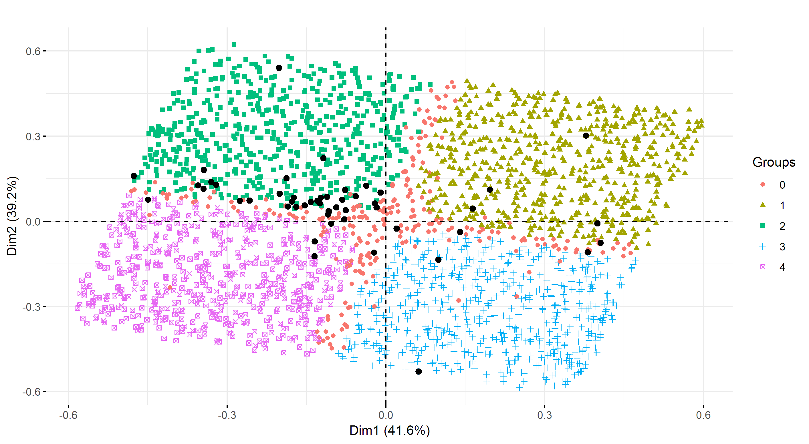
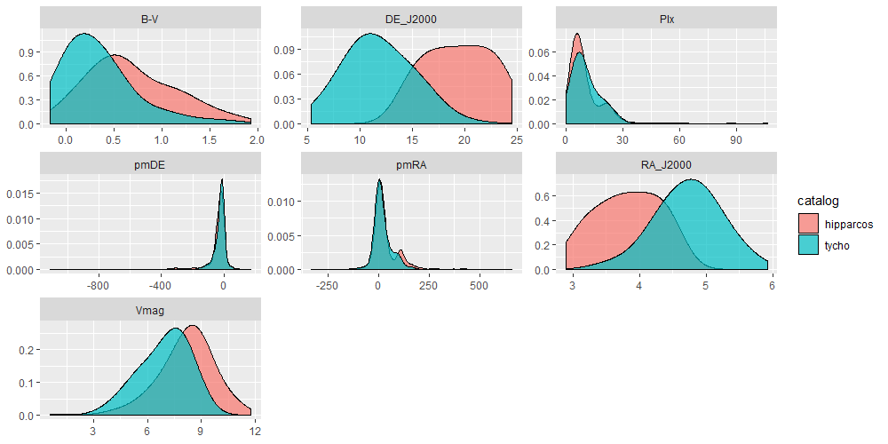
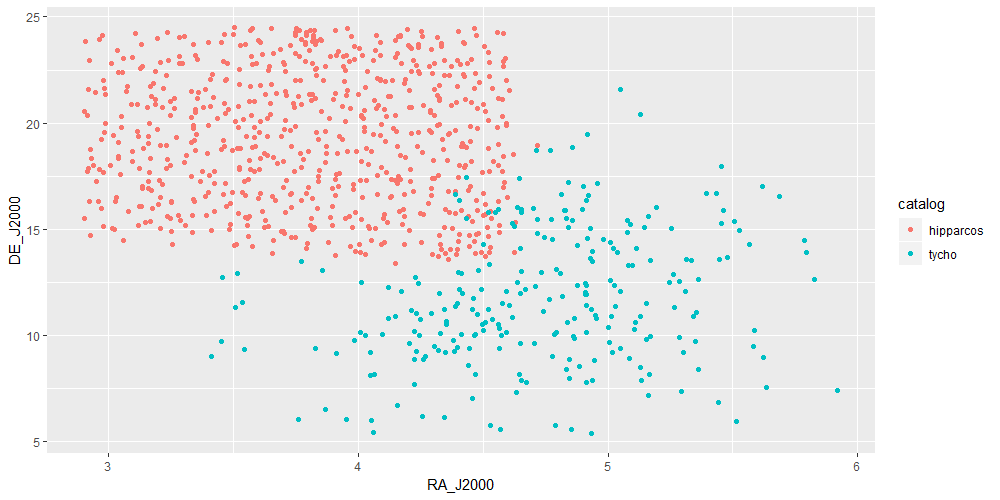

```{r setup, include=FALSE}
knitr::opts_chunk$set(echo=F, warning=F, message=F,
                      fig.align='center')
# load libraries y functions
source("functions.R")
source("libraries.R")
```

```{r objects, include=FALSE}
# carga objetos relevantes ya generados
hip_raw = readRDS("data/working/hip_raw.RDS")
tyc_raw = readRDS("data/working/tyc_raw.RDS")
hip_hopkins = readRDS("output/hopkins_hipparcos.RDS")
tyc_hopkins = readRDS("output/hopkins_tycho.RDS")
km_hip = readRDS("data/working/km_hipparcos.RDS")

```

# Comprensión del dominio

## Información general del dominio

En el presente informe se presenta un análisis realizado con base en (describir datos y cosas de astronomia que esten en la consigna). 

## Recursos

El análisis se llevó a cabo a partir de los datos disponibles en tres catálogos de estrellas: (describirlos brevemente) (ver Sección \@ref(datos-rec))

Se usó hardware de uso personal con un procesador XXX y XXX GB de memoria RAM.

(¿acá va R, Rstudio y librerias de R? Los pibes no lo pusieron)

## Objetivo de data mining

El objetivo principal del trabajo es (identificar Hyades potenciales, evaluar la bondad de los candidatos obtenidos, etc, ver consigna).

## Plan del proyecto

No corresponde.

# Comprensión de los datos

## Recolección inicial de los datos {#datos-rec}

Los datos analizados provienen de mediciones realizadas por (describir con un poco mas de detalle fuentes de los datos - formato del archivo - libreria de R para leer archivos Excel)

## Descripción de los datos {#datos-desc}

El catálogo Hipparcos cuenta con `r nrow(hip_raw)` estrellas, sobre las cuales se midieron los atributos descritos en el Cuadro \@ref(tab:hip-atr). Por su parte, Tycho tiene `r nrow(tyc_raw)` registros definidos por los atributos presentados en el Cuadro \@ref(tab:tyc-atr). `r sum(hip_raw$HIP %in% tyc_raw$HIP)` de las estrellas de Hipparcos se encuentran identificadas en Tycho.

```{r hip-atr}
hip_desc = readRDS("output/desc_hipparcos.RDS")
hip_desc %>% kable(caption="Descripción del catálogo Hipparcos",booktabs=T) %>% 
  kable_styling(latex_options="hold_position")
```

```{r tyc-atr}
tyc_desc = readRDS("output/desc_tycho.RDS")
tyc_desc %>% kable(caption="Descripción del catálogo Tycho",booktabs=T) %>% 
  kable_styling(latex_options="hold_position")
```
 
Para el análisis exploratorio y de clustering, en el caso de Hipparcos no se tuvo en cuenta la variable HIP por tratarse del atributo identificador. En cambio, los atributos TYCID1, TYCID2, TYCID3, HD y HIP de Tycho fueron descartados porque (xxx). Cabe destacar que el campo identificador HIP fue usado posteriormente para realizar una identificación cruzada que permitió descartar de Tycho los candidatos ya identificados como resultado del clusering sobre Hipparcos. 

## Exploración de los datos {#datos-exp}

<!-- Yo haria para cada catalogo: -->
<!-- 1 boxplot de cada variable con facet_wrap -->
<!-- 2 un ggpairs -->
<!-- 3 un biplot con factoextra::fviz_pca_biplot(prcomp(data_escalada), label="var") -->

<!-- (2 y 3 sirven para mostrar mas adelante que dbscan no fuciona, por ejemplo) -->

## Verificación de la calidad de los datos {#datos-calidad}

El análisis de la calidad de los datos consistió en la detección y análisis de datos faltantes. En Hipparcos únicamente la variable 'B-V' cuenta con registros faltantes, en particular en `r sum(is.na(hip_raw[['B-V']]))` de los `r nrow(hip_raw)` casos.

(aca meter lo de faltantes en tycho si lo hacemos)

# Preparación de los datos

## Selección de los datos

(acá va lo de las variables que no usamos? los pibes lo pusieron antes)

## Limpieza de datos

La principal tarea de limpieza fue el tratamiento de los datos faltantes. En el caso de la variable 'B-V' del catálogo Hipparcos se optó por reemplazar los datos faltantes por la mediana, debido a que solo representaban el  `r (sum(is.na(hip_raw[['B-V']])) / nrow(hip_raw) * 100) %>% round(2)`% de los casos.

En cambio, la variable Plx de Tycho fue omitida antes de realizar el análisis de clustering por la alta proporción de casos faltantes que presentó (`r (sum(is.na(tyc_raw[['Plx']])) / nrow(tyc_raw) * 100) %>% round(2) `%).

## Construcción de los datos

En ambos datasets se normalizaron las variables a partir de una transformación en z-scores. No se generaron nuevos registros ni atributos.

## Integración de los datos

No corresponde ya que se trabajó con cada catálogo por separado. Sin embargo, cabe destacar que para evitar obtener candidatos de Tycho que ya hayan sido identificados en los agrupamientos de Hipparcos, se omitieron las estrellas correspondientes en Tycho usando el campo de identificación cruzada HIP disponible en el dataset.

## Formateo de datos

No corresponde.

# Modelado

Antes de llevar adelante los agrupamientos, se computó el índice de Hopkins de tendencia a la clusterización en ambos catalógos, fijando una cantidad de puntos en el espacio al azar equivalente al 10% de cada dataset. El indicador arrojó un valor de `r hip_hopkins %>% round(4)` en Hipparcos y `r tyc_hopkins %>% round(4)` en Tycho, lo cual indica tendencias significativas al agrupamiento, y entonces que intentar clusterizar las estrellas es razonable.

## Selección de las técnicas de modelado

Las siguientes técnicas de clustering fueron implementadas sobre los dos catálogos para identificar candidatos: K-Medias, clustering difuso y DBSCAN. En el caso de Tycho se removieron del dataset las estrellas ya identificadas como candidatas en Hipparcos antes de implementar los algoritmos. En todas las ejecuciones se usó como medida de disimilitud la distancia euclidiana.

## Construcción de los modelos

### K-Medias

El algoritmo K-Medias se corrió usando su implementación *stats::kmeans()* disponible en R base. (REFERENCIA??) En cada ejecución del algoritmo se escogieron 20 asignaciones distintas de los centroides, seleccionandóse aquella que minimizara la suma de cuadrados dentro de los grupos.

Para definir la cantidad de agrupamientos óptima en Hipparcos se usaron dos criterios: la maximización del Silhouette promedio (S) y la búsqueda de un punto de quiebre en el scree-plot de la Suma de Cuadrados Dentro de los grupos (SCD). Para tal motivo, se generaron agrupamientos de K-Medias para 10 valores posibles de K, entre 1 y 10. Los resultados se visualizan en la figura \@ref(fig:kopt-km-hip). Como se observa, la cantidad óptima de agrupamientos bajo estos criterios es `r nrow(km_hip$centers)`.

```{r kopt-km-hip, out.width='40%',fig.show='hold', fig.cap="Selección de K para K-Medias (Hipparcos)"}
knitr::include_graphics(c("output/plots/kopt_sil_km_hipparcos.png",
                          "output/plots/kopt_scd_km_hipparcos.png"))
```

Una vez fijado el K en su valor óptimo, se obtuvo la representación del modelo en lenguaje PMML (ver Anexo). La misma fue importada y ejecutada en Python, obteniendo los mismos resultados que en R. 

En el catálogo Tycho se implementó K-Medias y se usó el mismo criterio para determinar el número óptimo de clusters, que resultó ser igual a `r nrow(km_tyc$centers)`, como se presenta en la Figura \@ref(fig:kopt-km-tyc).

```{r kopt-km-hip, out.width='40%',fig.show='hold', fig.cap="Selección de K para K-Medias (Tycho)"}
knitr::include_graphics(c("output/plots/kopt_sil_km_tycho.png",
                          "output/plots/kopt_scd_km_tycho.png"))
```

### Clustering difuso

El algoritmo de clustering difuso se corrió usando la implementación *fanny()* de la librería *cluster* para R. 

Para facilitar la comparación con los modelos de K-Medias, se seleccionó un K igual al identificado como óptimo para K-Medias en ambos catálogos. Por otra parte, se fijó el parámetro de *fuzziness* en $1.2$ (NO HAY TIEMPO PARA HACER ALGO MAS PROLIJO). 

### DBSCAN

Para ejecutar clustering por densidad se usó el algoritmo DBSCAN, en particular la implementación *dbscan()* de la librería *dbscan* para R. (REFERENCIA?) 

El parámetro *minPts* (umbral de objetos cercanos para identificar objetos semilla) fue fijado en un valor de 5. Para determinar el parámetro *eps* (radio para identificar objetos cercanos) se ordenaron los puntos según su distancia al 5to vecino y se graficó dicha distancia (ver Figura \@ref(fig:)).

```{r eps-db-hip, fig.cap="Selección de *eps* para DBSCAN (Hipparcos)"}
knitr::include_graphics("output/plots/eps_db_hip.png")
```

El objetivo es hallar un punto de quiebre a partir del cual las distancias incrementan significativamente la tasa de crecimiento. Este punto se encontró en una distancia aproximadamente igual a 0.2, de modo que se fijó a *eps* en este valor.

## Evaluación de los modelos

### K-Medias

En el Cuadro \@ref(tab:km-hd-hip) se observan la distribución de los clusters generados en función de la pertenencia al grupo de estrellas Hyades, para el catálogo Hipparcos. Bajo esta técnica fue posible identificar  `r as_tibble(hip_table_km_hd) %>% dplyr::filter(Hyades==F) %>% dplyr::filter(n==min(n)) %$% n` estrellas candidatas en Hipparcos con un nivel de confianza alto ya que `r as_tibble(hip_table_km_hd) %>% dplyr::filter(Hyades==T) %>% dplyr::filter(n==max(n)) %$% n` de las 50 Hyades se hallan agrupadas junto a ellas. Este es el principal criterio que define la bondad del modelo. 

```{r km-hd-hip}
hip_table_km_hd = readRDS("output/tablehyades_km_hipparcos.RDS")
xtable::xtable(hip_table_km_hd,
               caption="Distribución de estrellas Hyades en clusters de K-Medias (Hipparcos)",
               comment=F, 
               caption.placement="top")
```

El modelo también fue evaluado mediante el cálculo de Silhouette y su gráfico asociado, que se observa en la Figura \@ref(fig:km-sil-hip). Por último, en la Figura \@ref(fig:km-sil-hip) se presenta un diagrama de dispersión de las estrellas sobre las dos primeras componentes principales.

```{r km-sil-hip, fig.cap="Gráfico de Silhouette K-Means K=`r nrow(km_hip$centers)` (Hipparcos)"}
knitr::include_graphics("output/plots/sil_km_hipparcos.png")
```

```{r km-pca-hip, fig.cap="Dos dimensiones de PCA: K-Means K=`r nrow(km_hip$centers)` (Hipparcos)"}
knitr::include_graphics("output/plots/pca_km_hipparcos.png")
```

**HABLAR DE LOS RESULTADOS DE LOS GRAFICOS ds ds ds sdvsdvdavav**

En lo que respecta a Tycho, el Cuadro \@ref(tab:km-hd-tyc) indica la distribución de los agrupamientos en función de la pertenencia al cluster Hyades. Fue posible identificar `r as_tibble(tyc_table_km_hd) %>% dplyr::filter(Hyades==F) %>% dplyr::filter(n==min(n)) %$% n` estrellas candidatas en Tycho, que se encontraron agrupadas junto a `r as_tibble(tyc_table_km_hd) %>% dplyr::filter(Hyades==T) %>% dplyr::filter(n==max(n)) %$% n` de las Hyades ya conocidas.

```{r km-hd-tyc}
tyc_table_km_hd = readRDS("output/tablehyades_km_tycho.RDS")
xtable::xtable(tyc_table_km_hd,
               caption="Distribución de estrellas Hyades en clusters de K-Medias (Tycho)",
               comment=F, 
               caption.placement="top")
```

En las Figuras \@ref(fig:km-sil-tyc) y \@ref(fig:km-pca-tyc) se presentan el gráfico de Silhouette y el diagrama de dispersión de las dos primeras componentes principales, respectivamente, para el agrupamiento efectuado sobre Tycho.

```{r km-sil-tyc, fig.cap="Gráfico de Silhouette K-Means K=`r nrow(km_tyc$centers)` (Tycho)"}
knitr::include_graphics("output/plots/sil_km_tycho.png")
```

```{r km-pca-tyc, fig.cap="Dos dimensiones de PCA: K-Means K=`r nrow(km_tyc$centers)` (Tycho)"}
knitr::include_graphics("output/plots/pca_km_tycho.png")
```

**DESCRIBIR RESULTADOS**

### Clustering difuso

Luego de realizar los agrupamientos difusos, se registró la máxima probabilidad de pertenencia a cada grupo--el histograma correspondiente se presenta en la Figura \@ref(fig:hip_fa_probs). Se observa que un alta concentración de valores entre por encima de 0.8, lo que indica que las asignaciones son razonablemente unívocas.

```{r hip_fa_probs, fig.cap="Histograma: máxima probabilidad de pertenencia- Fuzziness=1.2 (Hipparcos)"}
knitr::include_graphics("output/plots/prob_hist_fuzzy_hipparcos.png")
```

Luego de la clusterización, se definió que aquellas estrellas con una probabilidad máxima menor a 0.6 no fueran agrupadas en ningún cluster, de modo que son incluidas como cluster *"0"*. El Cuadro \@ref(tab:fa-hd-hip) indica la distribución de los clusters en función de la pertenencia a Hyades. Se observa que una parte no despreciable las 50 estrellas Hyades no puede ser asignada unívocamente a ningún cluster bajo este criterio.

```{r fa-hd-hip}
hip_table_fa_hd = readRDS("output/tablehyades_fuzzy_hipparcos.RDS")
xtable::xtable(hip_table_fa_hd,
               caption="Distribución de estrellas Hyades en clusters difusos (Hipparcos)",
               comment=F, 
               caption.placement="top")
```

Los clusters obtenidos para Hipparcos se visualizan en la Figura \@ref(fig:fa-pca-hip).

```{r fa-pca-hip, fig.cap="Dos dimensiones de PCA: Clustering difuso K=`r nrow(km_hip$centers)` (Hipparcos)"}

```

**DESCRIBIR RESULTADOS**

**ESTO HAY QUE REPETIRLO PARA TYCHO SACANDO LOS CANDIDATOS DE HIP (CUALES SON?)**

### DBSCAN

El Cuadro \@ref(tab:db-hd-hip) indica la distribución de los clusters de DBSCAN en función de la pertenencia a Hyades. El cluster *"0"* corresponde a las estrellas clasificadas como ruido.

```{r db-hd-hip}
hip_table_db_hd = readRDS("output/tablehyades_dbscan_hipparcos.RDS")
xtable::xtable(hip_table_db_hd,
               caption="Distribución de estrellas Hyades en clusters de DBSCAN (Hipparcos)",
               comment=F, 
               caption.placement="top")
```

Se observa que se obtuvo un solo gran cluster que incluye a las Hyades, mientras que el `r hip_table_db_hd[1,1]/nrow(hip_sc)*100 %>% round(2)`% de las estrellas son clasificadas como ruido. Las características del dataset implican que no es posible hallar agrupamientos relevantes por densidad, de modo que se descarta este método para hallar estrellas candidatas.

# Evaluación

## Evaluación de resultados

Se usan las candidatas resultantes de K-Means. En la Figura \@ref(fig:res_scatter) se visualiza la posición de las candidatas en términos de RA y DE (**explicar mejor**). 

```{r res_scatter_pos, fig.cap="Candidatas de K-Means (Hipparcos -izquierda- y Tycho-derecha-)", out.width='40%',fig.show='hold'}
knitr::include_graphics(c("output/plots/scatter_res_hip_1.png",
                          "output/plots/scatter_res_tyc_1.png"))
```

DESCRIBIR LO QUE SE VE

En la Figura \@ref(fig:res_comp_dens) se comparan las candidatas que surgen de cada catálogo de forma univariada, para los atributos disponibles en ambos datasets.

```{r res_comp_dens, fig.cap="Comparación de candidatas"}

```

DESCRIBIR LO QUE SE VE. La posición de las candidatas en términos de RA y DE se observa en la Figura \@ref(fig:res_scatter_cand).

```{r res_scatter_cand, fig.cap="Comparación de candidatas"}

```

DESCRIBIR.

## Proceso de revisión

????

## Futuras etapas

????

# Implementación

No corresponde.

# Bibliografía (**???**)

# Anexo (**???**)

PONER EL PMML EN UNA PÁGINA ACÁ?


**AGREGAR QUE EN TYCHO SACAMOS LA VARIABLE V (ES LO MISMO QUE VT)**