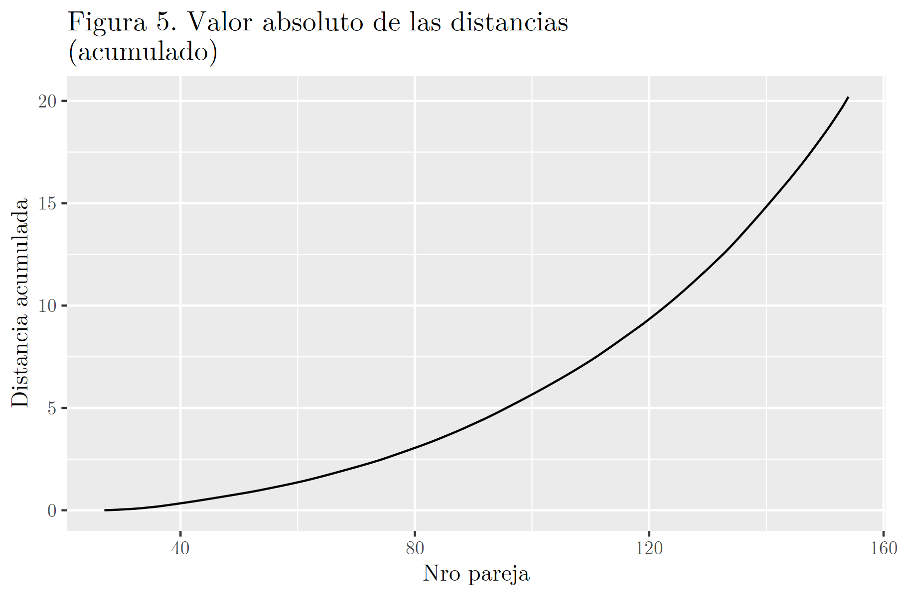

```{r, include=FALSE}
knitr::opts_chunk$set(echo=F, warning=F, message=F)

# load libraries y functions
source("functions.R")
source("libraries.R")
# corre la rutina del preinforme
source("01_preinforme.R")
```

En el presente informe se realiza una identificación cruzada entre las estrellas confirmadas de las Hyades en el catálogo Symbad y las correspondientes del catálogo Hipparcos.

# Primera etapa

Como primera aproximación se estudiaron las 24 estrellas de Symbad ya identificadas como Hyades en Hipparcos. Se computó la diferencia de ubicación en la medición de cada catálogo calculando la distancia euclidiana entre las coordenadas de las estrellas (RA y DE). En la Figura 1 se observa la distribución de dichas diferencias ("error de medición").

```{r out.height='60%', out.width='60%', fig.align="center"}
# histograma de los errores

```

Se buscó la máxima distancia para tenerla como referencia a la hora de construir umbrales de tolerancia para identificar estrellas en Hipparcos, siendo la misma de $`r max_error`$.

# Segunda etapa

Para identificar las `r nrow(sym) - nrow(idcruz)` Hyades restantes en el catálogo Hipparcos, se construyó una matriz de distancias euclidianas entre las mismas y las estrellas de Hipparcos no identificadas en la tabla de IDs cruzados.

A partir de esta matriz se obtuvieron pares de estrellas similares mediante el siguiente método: se seleccionó iterativamente el par de mínima distancia y eliminó de la matriz,  hasta que no quedaran estrellas Hyades por asignar. En caso de empate, se eligió al azar. De esta manera, se identificaron `r nrow(sym) - nrow(idcruz)` estrellas Hipparcos candidatas, cada una emparejada con una estrella Hyades de Symbad. Una vez construidos estos pares, se conservaron aquellos que presentaron una distancia menor al umbral máximo de distancia hallado en la primera etapa. 

Esto dio lugar a `r nrow(results) - nrow(resto)` estrellas Hyades identificadas en Hipparcos, que sumadas a las ya confirmadas conformaron un conjunto de `r nrow(results) - nrow(resto) + nrow(idcruz)` pares de estrellas Symbad-Hipparcos, tal que ningún emparejamiento presenta una distancia mayor que la máxima obtenida entre los pares de estrellas ya cruzados en la base provista inicialmente. Este proceso se resume en las Figuras 2 y 3, donde las estrellas son ubicadas en un plano según RA y DE.

```{r out.width='50%'}
knitr::include_graphics(c("output/plots/pre_02.png", "output/plots/pre_03.png"))
```

# Tercera etapa

Los `r nrow(resto)` pares de estrellas restantes que no lograron ser asignados usando el umbral fijado se presentan en la Figura 4. Visualmente se observa que podrían asignarse algunas Hyades con algunas de Hipparcos. Dependiendo del contexto, esto sería razonable o no. Las asignaciones más confiables son las realizadas en la segunda etapa. Para realizar esta tarea se probaron tres métodos.

```{r out.height='60%', out.width='60%', fig.align="center"}

```


## Prueba 1

Las `r nrow(resto)` parejas restantes fueron asignadas secuencialmente, y se computó para cada asignación el valor absoluto de la suma de las distancias entre cada par de estrellas ("D"), considerando las parejas asigndas previamente. El objeto es identificar un punto de quiebre a partir del cual D crezca abruptamente. Estos resultados se presentan en la Figura 5. Como se observa, el método no es satisfactorio ya que no se registra un claro punto de quiebre. 

```{r out.height='60%', out.width='60%', fig.align="center"}

```


## Prueba 2

Se determinó un umbral de error de medición tolerable más alto. Para ello, el valor inicial de $`r max_error`$ fue incrementado secuencialmente por un factor 'f'. Se probaron `r length(f_error)` valores para 'f', entre `r f_error[1]` y `r f_error[length(f_error)]`, y se observaron los diagramas de dispersión resultantes, aprovechando que los resultados se pueden visualizar fácilmente porque hay dos dimensiones y la cantidad de objetos no es alta. Las asginaciones más confiables se obtuvieron con un valor de 'f' de `r f_best`, y se presentan en la Figura 6. Como se observa en la comparación con la Figura 3, sólo fueron asignados `r sum(gdat6_list[[g_index]]$catalog=="hip_est1") - (nrow(results) - nrow(resto))` estrellas adicionales.    

```{r out.height='60%', out.width='60%', fig.align="center"}

```


## Prueba 3

Para identificar pares de estrellas no ambiguos -- es decir, tal que una estrella de Symbad se encuentre cerca de una y no más de una estrella de Hipparcos -- se probó el siguiente método. Se ordenaron las estrellas Symbad de menor a mayor según su menor distancia con respecto a cualquier estrella restante de Hipparcos. Se iteró por cada estrella Symbad, identificando a su vecino más cercano de Hipparcos como la misma estrella siempre y cuando la segunda estrella más cercana se encuentre más allá de un umbral de 'd' distancias (usando la distancia con respecto al vecino más cercano). A medida que se generaron parejas se fueron descartando las estrellas correspondientes para no reutilizarlas. A su vez, se descartó a cualquier otra estrella cuya estrella más cercana haya sido asignada en otro emparejamiento. 

Los resultados visuales de esta prueba no fueron satisfactorios para ningún valor de 'd', de modo que debe ser refinado en lo que resta del trabajo práctico. 
